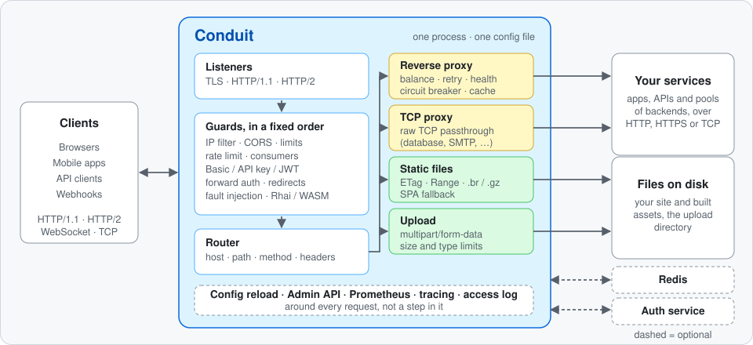
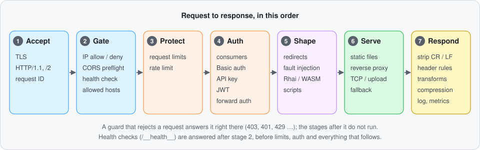
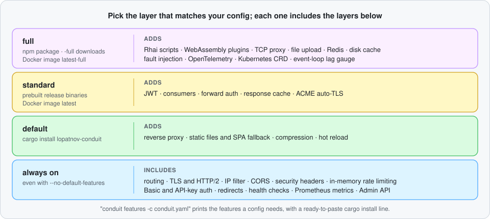

# Conduit

[](https://github.com/lopatnov/conduit/actions/workflows/ci.yml)
[](https://crates.io/crates/lopatnov-conduit)
[](https://crates.io/crates/lopatnov-conduit)
[](https://www.npmjs.com/package/@lopatnov/conduit)
[](https://www.npmjs.com/package/@lopatnov/conduit)
[](LICENSE)

**Conduit is a reverse proxy, API gateway and static file server written in Rust, built on
[Cloudflare Pingora](https://github.com/cloudflare/pingora).** You describe your sites, routes,
authentication, limits and caching in one YAML or JSON file and run one executable.

Put it in front of your apps to terminate TLS, route requests, authenticate and rate-limit
clients, cache responses and run your own scripted logic — or serve a single-page app and its API
from one port — without gluing together a proxy, an auth sidecar and a plugin system.

<p align="center">
  
</p>

```bash
npx @lopatnov/conduit init   # write a starter conduit.yaml
npx @lopatnov/conduit        # run it
```

## Why Conduit

- **One file, checked before it runs.** `conduit validate` reports problems with the path of the
  field (`error at sites[0].rateLimit.windowSecs: windowSecs must be greater than 0`), warns about
  keys it does not recognise (usually a typo) and exits non-zero on errors, so it fits in CI. A
  [JSON Schema](schema/conduit.schema.json) gives your editor completion and inline errors.
- **A proven engine underneath.** HTTP/1.1, HTTP/2, TLS (via rustls) and connection pooling come
  from Pingora, the Rust framework Cloudflare built for its own proxies. Conduit adds the
  configuration, guards, routing, caching and tooling on top.
- **You compile what you use.** Optional capabilities are Cargo features. The prebuilt binaries
  ship in a `standard` and a `full` flavour, and `conduit features` tells you which features a
  given config needs, so you can build something smaller.
- **Change it while it runs.** Most of the configuration reloads without a restart and without
  dropping connections (see [what needs a restart](#limits-you-should-know-about)).
- **Extend it without forking.** Write request and response logic as [Rhai](docs/rhai.md) scripts
  or [WebAssembly](docs/wasm.md) plugins in any language that compiles to WASM.

## Quick start

```bash
conduit init          # interactive wizard
conduit init --yes    # non-interactive: accept the defaults and write conduit.yaml
conduit validate      # check the config
conduit               # start
```

A minimal hand-written config. YAML and JSON are equivalent:

```yaml
# conduit.yaml
port: 8080
static: ./dist
proxy:
  /api: http://localhost:4000
```

```text
GET /          → ./dist/index.html
GET /logo.png  → ./dist/logo.png
GET /api/users → http://localhost:4000/api/users
```

```bash
curl http://localhost:8080/__health__
# {"status":"ok"}
```

**→ Ready-to-run configs:** [`examples/`](examples/) · **→ Every field:** [docs/configuration.md](docs/configuration.md)

## How a request flows

<p align="center">
  
</p>

Guards run in a fixed order, so you can reason about what happens first: a client blocked by the IP
filter never reaches rate limiting or auth, and a request that fails auth never reaches your
scripts or your upstream. Routing then picks the first matching route, and a handler serves it.

## What Conduit does

<table>
<tr><td><b>Proxying</b></td><td>Reverse proxy with round-robin, weighted round-robin, random, least-connections, least-response-time, IP-hash, consistent-hash and power-of-two-choices balancing; health checks, outlier detection, circuit breaker, sticky sessions, upstream groups</td></tr>
<tr><td><b>Static files</b></td><td>ETag, Last-Modified, Range, optional pre-compressed <code>.br</code>/<code>.gz</code> files, <code>Cache-Control</code>, SPA fallback</td></tr>
<tr><td><b>TLS</b></td><td>Your own certificates, automatic certificates from Let's Encrypt (ACME), mTLS client certificates, HTTP→HTTPS redirect, HTTP/2</td></tr>
<tr><td><b>Auth</b></td><td>Basic, API key, JWT (HS256 with a shared secret, RS256/ES256 through a JWKS URL), forward auth to your own service, named consumers with their own credentials and quotas</td></tr>
<tr><td><b>Rate limiting</b></td><td>Token bucket per client IP or header, burst capacity, per-route and per-consumer limits, optional Redis backend for several instances</td></tr>
<tr><td><b>Caching</b></td><td>Cache for proxied responses in memory, Redis or on disk; stale-while-revalidate, stale-if-error, request coalescing</td></tr>
<tr><td><b>Reliability</b></td><td>Retries with a budget and jitter, per-try timeouts, priority load shedding, traffic mirroring</td></tr>
<tr><td><b>Routing</b></td><td>Virtual hosts, path globs, methods, header regex, cookies and query parameters in an ordered route table</td></tr>
<tr><td><b>Middleware</b></td><td>Rhai scripts and WebAssembly plugins (Wasmtime), request and response header transforms, CORS, security headers, compression, fault injection</td></tr>
<tr><td><b>Observability</b></td><td>Prometheus metrics, OpenTelemetry (OTLP) tracing, structured JSON access log, <code>X-Request-ID</code></td></tr>
<tr><td><b>Operations</b></td><td>Hot config reload, Admin API, runtime IP deny-list, TCP proxy mode, multipart file upload, Kubernetes CRD provider</td></tr>
<tr><td><b>Deployment</b></td><td>One executable, a <code>FROM scratch</code> Docker image, systemd and Kubernetes examples, secrets from environment variables</td></tr>
</table>

Some of these are optional at build time. [Choose your build](#choose-your-build) shows which.

## Installation

### npx — nothing to install

```bash
npx @lopatnov/conduit init      # generate config
npx @lopatnov/conduit           # start the server
npx @lopatnov/conduit validate  # validate config
```

### npm global

```bash
npm install -g @lopatnov/conduit
conduit validate
conduit
```

The npm package downloads the native binary for your platform from
[GitHub Releases](https://github.com/lopatnov/conduit/releases) when it is installed (set
`CONDUIT_SKIP_DOWNLOAD=1` to skip that). Node.js is only needed for the download and for the
`conduit` launcher script; the server itself is the Rust binary. Since 2.0.0 the package installs
the **full** build; platforms: Linux x64 and arm64 (glibc), macOS Intel and Apple Silicon,
Windows x64. See the [npm package page](npm/Readme.md) for details.

### Pre-built binaries

Download from [GitHub Releases](https://github.com/lopatnov/conduit/releases):

| Platform             | Standard                                    | Full                                             |
| -------------------- | ------------------------------------------- | ------------------------------------------------ |
| Linux x86-64         | `conduit-x86_64-unknown-linux-gnu.tar.gz`   | `conduit-x86_64-unknown-linux-gnu-full.tar.gz`   |
| Linux x86-64 musl    | `conduit-x86_64-unknown-linux-musl.tar.gz`  | `conduit-x86_64-unknown-linux-musl-full.tar.gz`  |
| Linux ARM64          | `conduit-aarch64-unknown-linux-gnu.tar.gz`  | `conduit-aarch64-unknown-linux-gnu-full.tar.gz`  |
| Linux RISC-V 64      | `conduit-riscv64gc-unknown-linux-gnu.tar.gz`| —                                                |
| macOS Intel          | `conduit-x86_64-apple-darwin.tar.gz`        | `conduit-x86_64-apple-darwin-full.tar.gz`        |
| macOS Apple Silicon  | `conduit-aarch64-apple-darwin.tar.gz`       | `conduit-aarch64-apple-darwin-full.tar.gz`       |
| Windows x86-64       | `conduit-x86_64-pc-windows-msvc.exe.zip`    | `conduit-x86_64-pc-windows-msvc-full.exe.zip`    |

```bash
# Linux x86-64, standard
curl -L https://github.com/lopatnov/conduit/releases/latest/download/conduit-x86_64-unknown-linux-gnu.tar.gz \
  | tar xz && ./conduit-x86_64-unknown-linux-gnu --version
```

Every release also carries `SHA256SUMS.txt` and GitHub build-provenance attestations for the
binaries (`gh attestation verify <file> --repo lopatnov/conduit`). The musl builds are statically
linked; the glibc builds link the system C library dynamically.

### cargo install

```bash
cargo install lopatnov-conduit                       # default build
cargo install lopatnov-conduit --features standard   # + JWT, consumers, forward auth, cache, ACME
cargo install lopatnov-conduit --features full       # everything
```

For build instructions, feature bundles, cross-compilation and troubleshooting see
**[docs/building.md](docs/building.md)**.

### Docker

```bash
docker pull ghcr.io/lopatnov/conduit:latest        # standard build
docker pull ghcr.io/lopatnov/conduit:latest-full   # full build

docker run -p 8080:8080 \
  -v $(pwd)/conduit.yaml:/etc/conduit/conduit.yaml:ro \
  ghcr.io/lopatnov/conduit:latest -c /etc/conduit/conduit.yaml
```

The images are `FROM scratch` (a static musl binary, no shell, no OS userland) and run as UID
65534. **→ docker-compose, systemd, Kubernetes and a production checklist:**
[docs/deployment.md](docs/deployment.md)

## Choose your build

<p align="center">
  
</p>

| You install with                    | You get                                            |
| ----------------------------------- | -------------------------------------------------- |
| `npx` / `npm install -g`            | full                                               |
| GitHub Release archives             | standard, or full (files ending in `-full`)        |
| Docker                              | `:latest` is standard, `:latest-full` is full      |
| `cargo install lopatnov-conduit`    | the default build; add `--features …` for more     |

If your config uses a feature your binary was built without, `conduit validate` and the start-up
log say so instead of silently ignoring it. To go the other way and find out what a config
needs:

```console
$ conduit features -c conduit.yaml
required: proxy
build:    cargo install lopatnov-conduit --no-default-features --features proxy
bundle:   `--features gateway` also covers this configuration
```

### Optional features

| Feature           | What it enables                                                            |
| ----------------- | -------------------------------------------------------------------------- |
| `jwt`             | JWT Bearer-token auth and JWKS URLs (`jwtAuth`)                            |
| `consumers`       | Named API clients with per-consumer credentials and rate limits            |
| `forward-auth`    | Delegate auth to an external HTTP service (`forwardAuth`)                  |
| `rhai`            | Rhai scripting middleware (`type: "script"`)                               |
| `wasm`            | WebAssembly plugin middleware (`type: "wasm"`) through Wasmtime            |
| `tcp`             | Raw TCP proxy mode (`type: "tcp"` site)                                    |
| `upload`          | Multipart file upload handler (`upload:` site config)                      |
| `redis`           | Redis-backed rate limiting and caching                                     |
| `cache`           | Response caching (`proxy.*.cache`); implies `proxy`                        |
| `disk-cache`      | Disk-backed cache store (`cache.store: "disk:/path"`)                      |
| `acme`            | Automatic certificates from Let's Encrypt (`tls.acme`)                     |
| `fault-injection` | Fault injection for chaos testing                                          |
| `otlp`            | OpenTelemetry OTLP tracing (`global.otlp`)                                 |
| `tokio-metrics`   | `conduit_eventloop_lag_ms` Prometheus gauge (no config key)                |
| `kubernetes`      | Kubernetes CRD config provider (`--kubernetes-namespace`)                  |

Bundles: `standard` is `jwt` + `consumers` + `forward-auth` + `cache` + `acme` on top of the
default set; `full` is every feature above plus `standard`. `static-server` and `gateway` are
shorthands for `--no-default-features` builds: static serving without the proxy, or the proxy, auth,
cache and ACME stack without static files. `proxy`, `compression`, `static` and `hotreload` are on
by default.

## CLI commands

```text
conduit [-c FILE]                       start the server (default config: conduit.json, conduit.yaml or conduit.yml)
conduit validate [-c FILE]              validate the config — exit 0 = ok, exit 1 = errors
conduit features [-c FILE] [--json]     which Cargo features this config needs
conduit fmt [-c FILE] [--write]         pretty-print / normalise the config
conduit init [--yes] [-o FILE]          setup wizard (--yes = non-interactive)
conduit probe [-c FILE]                 ping every configured upstream and show latency

conduit reload   [--admin ADDR]         hot-reload the config
conduit status   [--admin ADDR]         version, uptime, in-flight requests
conduit status   [--admin ADDR] --upstream   upstream health table (latency, ejected, 5xx)
conduit shutdown [--admin ADDR]         graceful shutdown
conduit upstreams [--admin ADDR]        list upstream health and latency
conduit upstreams add    --route PATH --target URL [--weight N]
conduit upstreams remove --route PATH --target URL
conduit upstreams weight --route PATH --target URL --weight N

conduit completions bash|zsh|fish|power-shell|elvish   shell completion script
conduit man                             generate a man page (roff)
```

`reload`, `status`, `shutdown` and `upstreams` talk to the [Admin API](#admin-api). Changes made
with `upstreams add|remove|weight` live in memory only and are dropped by the next reload.
Full flag reference and exit codes: **[docs/cli.md](docs/cli.md)**

## Configuration

Config is a single YAML or JSON file. Without `-c`, Conduit looks for `conduit.json`, then
`conduit.yaml`, then `conduit.yml` in the current directory.

String values can reference environment variables (`"$VAR"`), which are expanded at start-up and
on reload. Keep secrets there rather than in the file.

```yaml
# conduit.yaml — annotated overview of common fields
port: 443
host: example.com          # virtual host (omit for catch-all)

tls:
  acme:                    # automatic certificates (--features acme)
    email: admin@example.com

http2: {}                  # HTTP/2 settings (on TLS ports it is negotiated via ALPN anyway)
compression: true
securityHeaders: true

proxy:
  /api:
    targets:
      - http://api-1:4000
      - http://api-2:4000
    strategy: least-conn
    healthCheck: { path: /health }
    retry: { attempts: 2, conditions: [5xx, connection_error] }
    cache: { store: memory, ttlSecs: 60 }

rateLimit:
  windowSecs: 60
  limit: 300

jwtAuth:                   # --features jwt
  jwksUrl: https://auth.example.com/.well-known/jwks.json
  audience: [my-api]

logging: json
metrics: { path: /__metrics__, token: "$METRICS_TOKEN" }
healthCheck: true
```

**→ All fields with examples:** [docs/configuration.md](docs/configuration.md)  
**→ Ready-to-run configs:** [examples/](examples/)

## Recipes

### Local dev server

```yaml
port: 3000
logging: dev
cors: true
hotReload: true
static: ./src
proxy:
  /api: http://localhost:4000
fallback: { file: ./src/index.html, status: 200 }
```

### JWT API gateway

```yaml
port: 8080
jwtAuth:                              # --features jwt
  jwksUrl: https://auth.example.com/.well-known/jwks.json
requestTransform:
  setHeaders:
    X-User-ID: "{{ jwt.sub }}"        # copy a claim into the upstream request
proxy:
  /users: http://users-svc:4001
  /orders: http://orders-svc:4002
rateLimit: { windowSecs: 60, limit: 500 }
maskErrors: true
metrics: { path: /__metrics__, token: "$METRICS_TOKEN" }
```

### Multi-site (one process, several domains)

```yaml
sites:
  - host: app.example.com
    port: 443
    tls: { acme: { email: admin@example.com } }
    static: ./dist
    proxy: { /api: http://api:4000 }

  - host: admin.example.com
    port: 443
    tls: { acme: { email: admin@example.com } }
    basicAuth: { users: { admin: "$ADMIN_PASSWORD" } }
    proxy: http://admin-backend:5000
```

**→ More scenarios:** [docs/recipes.md](docs/recipes.md) — HTTPS, load balancing, failover,
circuit breaker, caching, security hardening, observability, Kubernetes.

## Admin API

An optional management server, off unless you configure `global.admin.bind`. Bind it to loopback
(`127.0.0.1:2019`, which is also where the CLI commands look by default). Binding it to another
interface is possible, but only do that behind a VPN or an SSH tunnel and always with a token.

```yaml
global:
  admin:
    bind: "127.0.0.1:2019"
    token: "$ADMIN_TOKEN"    # Bearer token, strongly recommended
```

```bash
conduit reload                                     # hot-reload the config
conduit status                                     # uptime, version, in-flight count
conduit status --upstream                          # upstream health table
conduit upstreams add --route /api --target http://new-backend:4000

# or call the API directly (with a token configured, add -H "Authorization: Bearer $ADMIN_TOKEN")
curl http://localhost:2019/status
curl -X POST http://localhost:2019/reload
curl -X DELETE "http://localhost:2019/cache/purge?url=https://example.com/api/data"
curl -X POST http://localhost:2019/ip-deny -d '{"cidr":"1.2.3.0/24"}'
```

**→ All endpoints with request and response examples:** [docs/admin.md](docs/admin.md)

## Benchmarks

Every pull request runs a **Performance report** in CI that measures reverse-proxy passthrough
for the PR head and for its base commit, back to back on the same runner, and posts the
difference. It is a trend signal that catches regressions, not a lab measurement, and this README
quotes no throughput figure for that reason: GitHub-hosted runners land on different CPUs from
one run to the next, and earlier figures in the docs could not be reproduced (see
[issue #475](https://github.com/lopatnov/conduit/issues/475)). If you quote a number, quote its
setup too. This is the setup CI uses:

| | |
| --- | --- |
| Runner | GitHub-hosted `ubuntu-latest`: 4 vCPU, 16 GB RAM. The host CPU model differs between runs and is printed in every report. |
| Conduit | `cargo build --release` with default features (`lto = true`, `codegen-units = 1`, stripped), run with the default of **one worker thread** (`global.workers` unset) |
| Upstream | a small Go `net/http` server on port 4000 returning a fixed 22-byte JSON body ([source](docs/benchmarks.md#ci-performance-report-exact-setup)) |
| Load generator | [oha](https://github.com/hatoo/oha) 1.16.0: `oha -z 10s -c 50 --no-tui --output-format json http://127.0.0.1:8080/` |
| What is compared | PR head against PR base, built and measured in the same job |

The server configuration, as JSON (what CI writes) and as the equivalent YAML:

```json
{ "port": 8080, "proxy": "http://127.0.0.1:4000" }
```

```yaml
port: 8080
proxy: http://127.0.0.1:4000
```

Throughput grows with `global.workers`, up to what the machine can give. For scripts that
measure requests per second and CPU cost per request on your own hardware, see
[`scripts/bench/`](scripts/bench/README.md); [docs/benchmarks.md](docs/benchmarks.md) has the
step-by-step setup and the historical per-feature measurements.

## Limits you should know about

- **HTTP/3 (QUIC) is not supported.** Clients connect over HTTP/1.1 and HTTP/2; HTTP/3 depends on
  support in Pingora.
- **TLS versions and cipher suites are not configurable.** `tls.versions` and `tls.ciphers` are
  rejected by `conduit validate` because the TLS layer offers no way to apply them.
- **Some settings need a restart:** `port`, `tls.cert` / `tls.key`, `workers`,
  `global.shutdownTimeoutSecs` and `global.admin.bind`. Everything else reloads in place.
- **One worker thread by default.** Set `global.workers` to use more cores.
- **Scripts and plugins fail open.** If a Rhai script or a WASM plugin cannot be loaded or errors
  at run time, the problem is logged and the request continues. Do not rely on a script or plugin
  as your only access check.
- **No PROXY protocol** support yet, on either the listening or the upstream side.

## Editor integration (JSON Schema)

Conduit ships a [JSON Schema](schema/conduit.schema.json) for completion, hover docs and inline
validation in JSON and YAML configs.

**VS Code — JSON: add one line to your config:**

```json
{
  "$schema": "https://raw.githubusercontent.com/lopatnov/conduit/main/schema/conduit.schema.json",
  "port": 3000
}
```

**VS Code — JSON: workspace-wide (all `conduit*.json` files):**

```json
// .vscode/settings.json
{
  "json.schemas": [{
    "fileMatch": ["conduit.json", "conduit.*.json"],
    "url": "https://raw.githubusercontent.com/lopatnov/conduit/main/schema/conduit.schema.json"
  }]
}
```

**VS Code — YAML: add to `.vscode/settings.json`** (requires the
[YAML extension](https://marketplace.visualstudio.com/items?itemName=redhat.vscode-yaml)):

```json
// .vscode/settings.json
{
  "yaml.schemas": {
    "https://raw.githubusercontent.com/lopatnov/conduit/main/schema/conduit.schema.json":
      ["conduit.yaml", "conduit.yml", "conduit.*.yaml"]
  }
}
```

**IntelliJ / WebStorm:** Settings → Languages & Frameworks → Schemas and DTDs → JSON Schema
Mappings → add the URL `https://raw.githubusercontent.com/lopatnov/conduit/main/schema/conduit.schema.json`
with the file pattern `conduit*.json, conduit*.yaml`.

## Documentation

| Read this                                | When you want to                                                  |
| ---------------------------------------- | ----------------------------------------------------------------- |
| [docs/configuration.md](docs/configuration.md) | look up any config field, in YAML and JSON                  |
| [docs/recipes.md](docs/recipes.md)       | start from a working config for a common scenario                 |
| [docs/cli.md](docs/cli.md)               | see every command, flag, exit code and build feature              |
| [docs/admin.md](docs/admin.md)           | manage a running server over the Admin API                        |
| [docs/deployment.md](docs/deployment.md) | run it in production: Docker, systemd, Kubernetes                 |
| [docs/building.md](docs/building.md)     | build from source, pick features, cross-compile                   |
| [docs/rhai.md](docs/rhai.md)             | write request and response logic as scripts                       |
| [docs/wasm.md](docs/wasm.md)             | write plugins in Rust, C, Go, AssemblyScript or Zig               |
| [docs/benchmarks.md](docs/benchmarks.md) | reproduce a measurement or read the historical ones               |
| [examples/](examples/)                   | copy a complete, validated config                                 |

## Contributing

Contributions are welcome. Read [CONTRIBUTING.md](CONTRIBUTING.md) before opening a PR.

- **Bug reports** → [GitHub Issues](https://github.com/lopatnov/conduit/issues)
- **Security vulnerabilities** → [GitHub Security Advisories](https://github.com/lopatnov/conduit/security/advisories) (not public issues)
- **Questions and ideas** → [GitHub Discussions](https://github.com/lopatnov/conduit/discussions)
- **Found it useful?** A ⭐ helps others discover the project

## License

[Apache 2.0](LICENSE) © 2024–2026 [Oleksandr Lopatnov](https://github.com/lopatnov)
